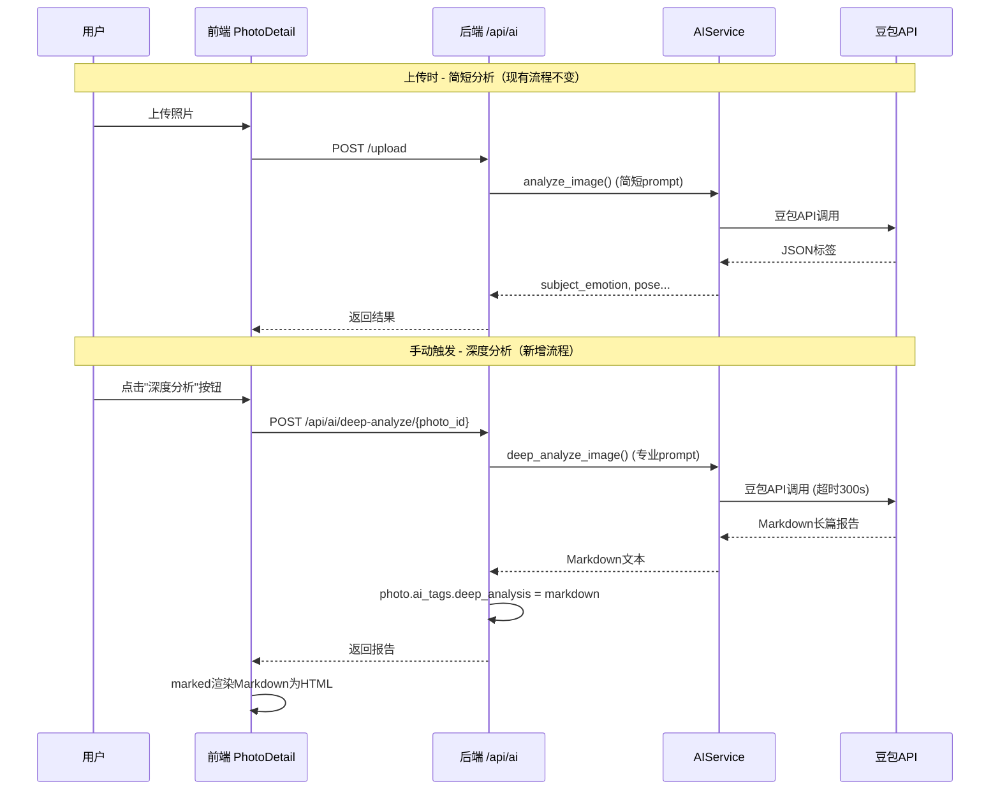

## Product Overview

将SmartAlbum的AI智能识别自动标签功能，升级为基于大模型的自动图片深度分析功能。保留现有简短标签用于搜索和卡片预览，新增专业级人像摄影深度分析报告功能。

## Core Features

1. **后端新增 `deep_analyze_image()` 方法**：在 `AIService` 中新增深度分析方法，使用用户提供的专业人像摄影prompt，返回Markdown格式的7大模块深度分析报告
2. **后端新增深度分析API**：`POST /api/ai/deep-analyze/{photo_id}`，执行深度分析并将Markdown报告存入 `photo.ai_tags.deep_analysis` 字段
3. **前端安装Markdown渲染库**：安装 `marked` 库用于渲染Markdown为HTML
4. **前端照片详情页右侧面板升级**：在现有AI标签和描述下方，新增"AI深度分析"区域，显示Markdown渲染的深度报告；若尚未执行深度分析，显示"生成深度分析"按钮
5. **前端照片详情页顶部新增"深度分析"按钮**：在工具栏中添加按钮，点击触发深度分析
6. **深度分析与简短标签共存**：`ai_tags` JSON字段中，原有字段（subject_emotion等）不变，新增 `deep_analysis` 字段存储Markdown报告
7. **分析状态反馈**：深度分析耗时长，前端显示loading状态和进度提示

## Tech Stack

- 后端：Python + FastAPI + 豆包多模态API (doubao-seed-2-0-mini-260215)
- 前端：Vue 3 + TypeScript + Tailwind CSS + marked (Markdown渲染)

## Implementation Approach

### 策略

在现有 `AIService.analyze_image()` 基础上，新增 `deep_analyze_image()` 方法，使用专业摄影prompt替代原有简短prompt，请求模型返回Markdown格式的长篇分析报告。不修改原有 `analyze_image()` 方法，确保向后兼容。

### 数据存储

- 利用现有 `Photo.ai_tags` JSON字段（SQLite无大小限制）
- 新增 `deep_analysis` 键存储Markdown文本
- 新增 `deep_analysis_time` 键存储分析时间
- 原有 `subject_emotion`/`pose` 等字段保持不变

### API设计

- 新增 `POST /api/ai/deep-analyze/{photo_id}` - 触发深度分析
- HTTP超时从120秒提升至300秒（深度分析耗时长）
- 复用 `_call_via_http()` 底层方法，仅替换system_prompt

### 前端展示

- 安装 `marked` 库，封装 `renderMarkdown()` 工具函数
- PhotoDetail.vue 右侧面板在现有AI标签下方新增深度分析区域
- 使用Tailwind CSS的 `prose` 类配合自定义样式渲染Markdown
- 深度分析未生成时，显示"生成深度分析报告"按钮
- 生成过程中显示loading动画和提示文字

## Architecture Design



## Directory Structure

```
backend/app/services/
└── ai_service.py  # [MODIFY] 新增 deep_analyze_image() 方法和专业prompt常量

backend/app/api/
└── ai.py          # [MODIFY] 新增 POST /api/ai/deep-analyze/{photo_id} 端点

frontend/src/
├── types/
│   └── photo.ts   # [MODIFY] AITags 接口新增 deep_analysis 和 deep_analysis_time 字段
├── utils/
│   └── markdown.ts  # [NEW] Markdown渲染工具函数
├── views/
│   └── PhotoDetail.vue  # [MODIFY] 右侧面板新增深度分析区域 + 顶部工具栏新增按钮
└── components/
    └── DeepAnalysis.vue  # [NEW] 深度分析报告渲染组件

package.json         # [MODIFY] 新增 marked 依赖
```

## Implementation Notes

### 关键约束

- 深度分析prompt极长（用户提供的完整prompt），需作为类常量或独立文件存储，不硬编码在方法内
- 豆包API max_output_tokens=32768，深度报告可能接近上限，需在prompt中提示控制篇幅
- HTTP超时需从120s提升至300s，深度分析通常需要60-180秒
- 前端axios调用深度分析API时，timeout也需单独设置为300s（区别于其他30s的API调用）
- Markdown渲染需要CSS样式支持（标题、列表、表格、加粗等），需在PhotoDetail中添加 `prose` 样式或自定义CSS

### 性能考量

- 深度分析为耗时操作（60-180秒），仅用户手动触发，不影响上传流程
- Markdown报告存储在JSON字段中，SQLite无大小限制，预计单次报告10-20KB
- 前端marked渲染为纯客户端操作，无性能瓶颈

## Design Style

在现有深色玻璃拟态（Glassmorphism）风格基础上，深度分析报告区域采用卡片式布局，Markdown渲染内容使用优雅的排版样式。

## Page Design

### PhotoDetail.vue 右侧面板（自上而下）

1. **评分区域** - 保持不变
2. **拍摄信息（EXIF）** - 保持不变
3. **AI识别标签** - 保持不变（简短标签）
4. **AI描述** - 保持不变
5. **AI深度分析** - [新增] 

- 未生成时：显示"生成深度分析报告"按钮 + 说明文字
- 生成中：显示loading动画 + "AI正在深度分析中，预计需要1-3分钟..."
- 已生成：Markdown渲染的完整报告，带滚动区域

### 顶部工具栏

- 在"收藏"和"删除"按钮之间，新增"深度分析"按钮（Sparkles图标）
- 按钮tooltip："生成AI深度分析报告"

### DeepAnalysis.vue 组件样式

- 使用自定义prose样式渲染Markdown
- 二级标题：主色调文字，带左侧竖线装饰
- 三级标题：加粗，浅色文字
- 列表：自定义marker样式
- 表格：圆角边框，交替行背景
- 加粗文字：主色调高亮

## Agent Extensions

### SubAgent

- **code-explorer**
- Purpose: 在实现过程中，如需确认其他文件的代码结构或调用关系，使用此子代理进行多文件搜索
- Expected outcome: 快速定位相关代码位置，确保修改不影响现有功能