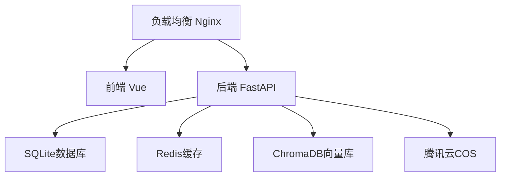

## 项目概述

SmartAlbum v2.0 智能相册管理系统生产环境部署任务规划，包含17项代码修复（安全、性能、质量）的完整升级部署方案。

## 核心需求

1. 前置准备阶段：环境配置、备份策略、通知协调
2. 具体执行步骤：分阶段部署流程，明确每个任务的执行命令和验证方式
3. 风险评估及回滚策略：识别风险点，制定应急预案和自动回滚方案
4. 责任分工：明确各角色职责和任务分配
5. 关键路径：识别部署关键路径，确保按时完成
6. 数据备份与环境验证：完整备份流程和验证检查点
7. 上线后监控：监控指标、告警规则和问题响应流程

## 技术栈

- 后端：FastAPI 0.109.0, SQLAlchemy 2.0.25, Python 3.11
- 前端：Vue 3.5.12, TypeScript 5.6, Vite
- 部署：Docker Compose, Ubuntu 24.04 LTS
- 监控：Prometheus + Grafana（可选）
- 备份：SQLite备份 + 文件归档

## 部署架构

## 关键技术决策

1. 蓝绿部署：通过Docker快速切换版本
2. 数据持久化：SQLite文件 + 存储目录挂载
3. 健康检查：HTTP端点轮询验证
4. 自动回滚：脚本化一键回滚能力

## Agent Extensions

### SubAgent

- **code-explorer**
- Purpose: 搜索和验证部署相关配置文件（docker-compose.yml、Dockerfile、.env等）
- Expected outcome: 确认配置文件完整性和正确性