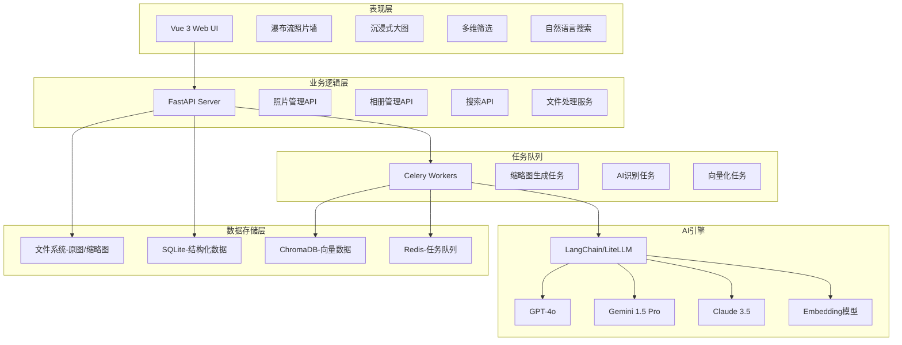
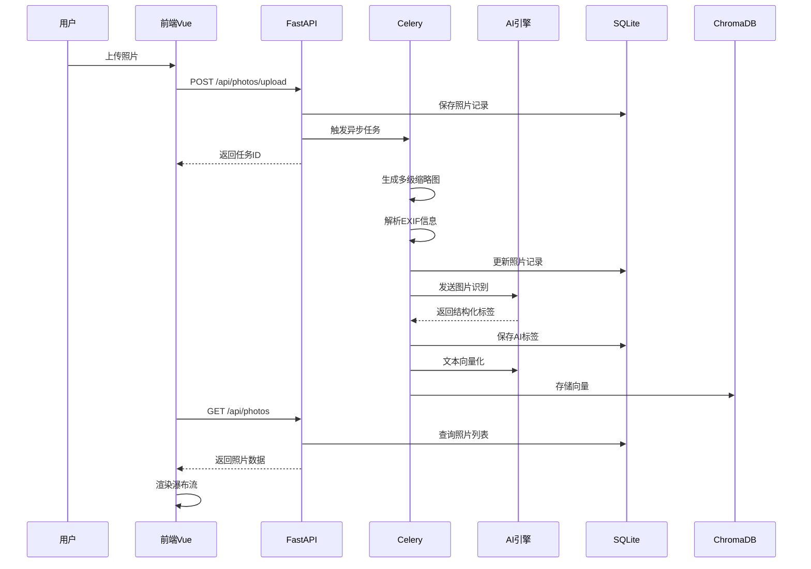

## 产品概述

本地私房人像相册智能管理系统，采用B/S架构，前后端分离设计。系统专注于私密人像照片的智能管理、AI识别和自然语言检索，提供瀑布流展示、沉浸式浏览、智能分类和语义搜索等核心功能。

## 核心功能

**基础功能模块**

- 照片上传与存储：支持批量上传、自动去重、文件校验
- 多级缩略图生成：微缩图（占位）、中等尺寸（瀑布流）、大尺寸（预览）三级缓存
- EXIF信息解析：自动提取拍摄时间、相机型号、焦段、光圈快门等元数据
- 瀑布流照片墙：响应式布局，支持虚拟滚动优化性能
- 沉浸式大图查看：PhotoSwipe集成，支持手势缩放、全屏浏览
- 多维度筛选：基于时间、相机、镜头、AI标签等多条件组合筛选
- 智能相册管理：支持手动创建、规则自动归类、动态相册
- 评分系统：手动1-5星打分，支持AI辅助美学评分

**AI智能模块**

- 多模态识别：接入GPT-4o/Gemini/Claude，结构化输出情绪、姿态、穿搭、光影、场景等标签
- 特征向量化：将照片描述文本转化为向量，存入ChromaDB
- 自然语言检索：语义搜索，支持"穿着白色吊带裙坐在地毯上的黑发女孩"等自然语言查询
- 人脸聚类：本地face_recognition库实现人脸检测与聚类，区分不同模特
- 多模型切换：LangChain/LiteLLM统一接口，灵活切换AI模型

**用户管理**

- 单管理员模式：简化权限管理，适合个人私用场景

## 技术栈选择

### 前端技术栈

- **框架**: Vue 3 + TypeScript（响应式、类型安全、生态完善）
- **样式**: Tailwind CSS（快速开发、高度可定制）
- **图片浏览**: PhotoSwipe（原生手势支持、适合高清人像鉴赏）
- **状态管理**: Pinia（Vue 3官方推荐）
- **HTTP客户端**: Axios
- **构建工具**: Vite（开发体验优秀、构建速度快）

### 后端技术栈

- **框架**: FastAPI（高性能异步框架、原生支持异步、自动生成API文档）
- **ORM**: SQLAlchemy（成熟稳定、支持异步）
- **数据库**: SQLite（轻量级、零配置、适合单机部署）
- **任务队列**: Celery + Redis（异步处理大批量照片导入和AI识别）
- **向量数据库**: ChromaDB（轻量级、支持本地持久化、易于集成）
- **图像处理**: Pillow（缩略图生成）、python-multipart（文件上传）

### AI集成

- **多模态接口**: LangChain（统一抽象层、支持多模型切换）
- **向量嵌入**: text-embedding-3-small（OpenAI）或BGE模型（本地）
- **人脸识别**: face_recognition（本地轻量级方案）

## 技术架构

### 系统架构图



### 数据流设计



## 目录结构

```
SmartAlbum/
├── frontend/                      # 前端项目
│   ├── src/
│   │   ├── views/                 # 页面组件
│   │   │   ├── PhotoGallery.vue   # [NEW] 瀑布流照片墙主页面
│   │   │   ├── PhotoDetail.vue    # [NEW] 大图浏览详情页
│   │   │   ├── Albums.vue         # [NEW] 智能相册管理页
│   │   │   └── Settings.vue       # [NEW] 系统设置页
│   │   ├── components/            # 通用组件
│   │   │   ├── PhotoCard.vue      # [NEW] 照片卡片组件
│   │   │   ├── FilterPanel.vue    # [NEW] 多维筛选面板
│   │   │   ├── SearchBar.vue      # [NEW] 搜索栏（含自然语言）
│   │   │   ├── UploadZone.vue     # [NEW] 文件上传区域
│   │   │   └── PhotoViewer.vue    # [NEW] PhotoSwipe封装组件
│   │   ├── stores/                # Pinia状态管理
│   │   │   ├── photoStore.ts      # [NEW] 照片状态管理
│   │   │   ├── albumStore.ts      # [NEW] 相册状态管理
│   │   │   └── settingStore.ts    # [NEW] 设置状态管理
│   │   ├── api/                   # API请求封装
│   │   │   ├── photo.ts           # [NEW] 照片相关API
│   │   │   ├── album.ts           # [NEW] 相册相关API
│   │   │   └── search.ts          # [NEW] 搜索相关API
│   │   ├── types/                 # TypeScript类型定义
│   │   │   ├── photo.ts           # [NEW] 照片类型
│   │   │   ├── album.ts           # [NEW] 相册类型
│   │   │   └── ai.ts              # [NEW] AI标签类型
│   │   ├── utils/                 # 工具函数
│   │   │   ├── watermark.ts       # [NEW] 防截屏水印
│   │   │   └── format.ts          # [NEW] 格式化工具
│   │   ├── App.vue                # [NEW] 根组件
│   │   └── main.ts                # [NEW] 入口文件
│   ├── public/                    # 静态资源
│   ├── index.html                 # [NEW] HTML模板
│   ├── vite.config.ts             # [NEW] Vite配置
│   ├── tailwind.config.js         # [NEW] Tailwind配置
│   ├── tsconfig.json              # [NEW] TypeScript配置
│   └── package.json               # [NEW] 依赖配置
│
├── backend/                       # 后端项目
│   ├── app/
│   │   ├── main.py                # [NEW] FastAPI应用入口
│   │   ├── config.py              # [NEW] 配置管理
│   │   ├── database.py            # [NEW] 数据库连接
│   │   ├── models/                # SQLAlchemy模型
│   │   │   ├── photo.py           # [NEW] 照片模型
│   │   │   ├── album.py           # [NEW] 相册模型
│   │   │   ├── ai_tag.py          # [NEW] AI标签模型
│   │   │   └── face_cluster.py    # [NEW] 人脸聚类模型
│   │   ├── schemas/               # Pydantic模式
│   │   │   ├── photo.py           # [NEW] 照片Schema
│   │   │   ├── album.py           # [NEW] 相册Schema
│   │   │   └── search.py          # [NEW] 搜索Schema
│   │   ├── api/                   # API路由
│   │   │   ├── photos.py          # [NEW] 照片管理API
│   │   │   ├── albums.py          # [NEW] 相册管理API
│   │   │   ├── search.py          # [NEW] 搜索API
│   │   │   └── upload.py          # [NEW] 上传API
│   │   ├── services/              # 业务逻辑服务
│   │   │   ├── photo_service.py   # [NEW] 照片处理服务
│   │   │   ├── thumbnail_service.py # [NEW] 缩略图服务
│   │   │   ├── exif_service.py    # [NEW] EXIF解析服务
│   │   │   ├── ai_service.py      # [NEW] AI识别服务
│   │   │   ├── embedding_service.py # [NEW] 向量化服务
│   │   │   └── face_service.py    # [NEW] 人脸聚类服务
│   │   └── utils/                 # 工具函数
│   │       ├── file_utils.py      # [NEW] 文件处理工具
│   │       └── image_utils.py     # [NEW] 图像处理工具
│   ├── tasks/                     # Celery任务
│   │   ├── celery_app.py          # [NEW] Celery应用配置
│   │   ├── photo_tasks.py         # [NEW] 照片处理任务
│   │   └── ai_tasks.py            # [NEW] AI识别任务
│   ├── alembic/                   # 数据库迁移
│   │   └── versions/              # [NEW] 迁移版本
│   ├── requirements.txt           # [NEW] Python依赖
│   └── alembic.ini                # [NEW] 迁移配置
│
├── storage/                       # 存储目录
│   ├── originals/                 # [NEW] 原图存储
│   ├── thumbnails/                # [NEW] 缩略图存储
│   │   ├── small/                 # 微缩图（占位）
│   │   ├── medium/                # 中等尺寸（瀑布流）
│   │   └── large/                 # 大尺寸（预览）
│   └── face_data/                 # [NEW] 人脸数据
│
├── data/                          # 数据库文件
│   ├── smartalbum.db              # [NEW] SQLite数据库
│   └── chroma/                    # [NEW] ChromaDB数据
│
├── docker-compose.yml             # [NEW] Docker编排配置
├── .env.example                   # [NEW] 环境变量示例
└── README.md                      # [NEW] 项目说明文档
```

## 实施要点

### 性能优化

- **前端虚拟滚动**：瀑布流采用虚拟滚动技术，只渲染可视区域照片，避免DOM过多
- **缩略图分级**：三级缓存策略，按需加载不同尺寸，减少带宽占用
- **异步任务处理**：大批量上传通过Celery异步处理，避免阻塞主线程
- **向量检索优化**：ChromaDB使用HNSW索引，快速检索相似向量

### 安全性考虑

- **本地存储**：所有数据本地保存，不上传云端，保护隐私
- **API密钥管理**：通过环境变量配置，不入代码库
- **防截屏水印**：前端可添加用户信息水印，防止未授权传播

### 扩展性设计

- **AI模型可切换**：LangChain抽象层支持灵活切换GPT-4o/Gemini/Claude
- **模块化架构**：前后端分离，服务层清晰，便于功能扩展
- **数据库迁移**：Alembic管理数据库版本，支持平滑升级

## 核心数据模型

### 照片表

```typescript
interface Photo {
  id: string;
  filename: string;
  original_path: string;
  file_size: number;
  file_hash: string;           // MD5去重
  
  // EXIF信息
  shot_time: Date;
  camera_model: string;
  lens_model: string;
  focal_length: number;
  aperture: number;
  shutter_speed: string;
  iso: number;
  
  // AI标签（JSON存储）
  ai_tags: {
    subject_emotion: string;    // 主体情绪
    pose: string;               // 姿态
    clothing_style: string;     // 穿搭风格
    lighting: string;           // 光影特征
    environment: string;        // 环境场景
    overall_description: string; // 完整描述
    aesthetic_score: number;    // 美学评分
  };
  
  // 用户数据
  rating: number;              // 用户评分1-5
  is_favorite: boolean;
  face_cluster_id: string;     // 人脸聚类ID
  
  created_at: Date;
  updated_at: Date;
}
```

### 相册表

```typescript
interface Album {
  id: string;
  name: string;
  description: string;
  cover_photo_id: string;
  
  // 智能相册规则
  is_smart: boolean;
  rules: {
    field: string;             // 筛选字段
    operator: string;          // 操作符
    value: any;                // 值
  }[];
  
  photo_count: number;
  created_at: Date;
  updated_at: Date;
}
```

## 设计风格

采用现代极简主义风格，以深色主题为主基调，营造专业、私密的视觉氛围。设计灵感来源于Apple Photos和Google Photos，结合摄影作品集的展示美学，突出照片内容本身。

## 页面规划

### 1. 照片墙主页

**顶部导航栏**

- 左侧：Logo + 系统名称
- 中间：自然语言搜索栏（带AI图标提示）
- 右侧：上传按钮、设置入口

**筛选侧边栏**

- 时间筛选：年/月/日时间轴
- 相机设备：品牌、型号筛选
- AI标签：情绪、风格、光影、场景等多维标签云
- 评分筛选：星级选择器

**瀑布流主区域**

- 响应式瀑布流布局，列宽自适应
- 照片卡片：悬停显示EXIF摘要、评分星级
- 虚拟滚动优化，流畅加载大量照片
- 支持多选批量操作

**底部信息栏**

- 当前筛选照片数量统计
- 存储空间占用情况

### 2. 大图浏览页

**沉浸式查看器**

- 全屏深色背景，突出照片主体
- PhotoSwipe手势支持：双指缩放、单指拖动
- 左右滑动切换照片

**信息面板（可折叠）**

- EXIF完整信息展示
- AI识别标签展示
- 用户评分与收藏操作
- 所属相册列表

**快捷操作栏**

- 下载、删除、添加到相册
- 上一张/下一张导航

### 3. 智能相册页

**相册网格展示**

- 卡片式相册封面
- 显示照片数量、创建时间
- 智能相册标记（动态图标）

**相册创建/编辑**

- 规则构建器：可视化设置智能相册规则
- 封面选择器
- 名称与描述输入

### 4. 系统设置页

**AI模型配置**

- 模型选择下拉框（GPT-4o/Gemini/Claude）
- API密钥配置（加密存储）
- 模型切换状态指示

**存储管理**

- 存储路径配置
- 缓存清理
- 数据备份与恢复

**任务队列监控**

- Celery任务状态
- 处理进度展示
- 失败任务重试