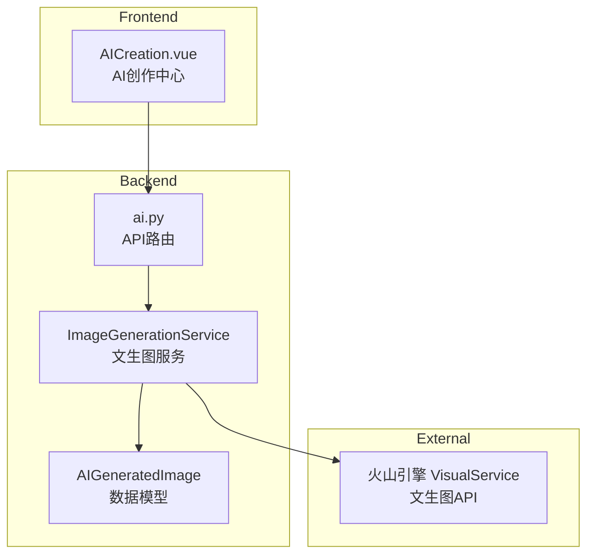

## 产品概述

为SmartAlbum智能相册系统新增豆包多模态大模型文生图功能，支持用户通过文字描述生成艺术图片，或基于相册中的照片生成AI艺术版本。

## 核心功能

- **独立文生图**：输入文字描述生成全新艺术图片
- **基于照片生成**：选择相册中的照片，生成AI艺术版本
- **多模型支持**：支持高美感通用V1.3、动漫风格等多种模型切换
- **灵活存储**：生成的图片可选择是否保存到相册系统
- **历史记录**：查看和管理所有生成记录

## 技术栈

- **后端框架**：FastAPI + SQLAlchemy（与现有架构一致）
- **文生图SDK**：volcengine-python-sdk 的 VisualService
- **数据库**：SQLite（现有）
- **前端框架**：Vue 3 + TypeScript + Vite（与现有架构一致）
- **UI组件库**：TDesign Vue Next

## 实现方案

### 1. 后端服务层

新增 `ImageGenerationService` 类，封装火山引擎文生图API调用：

- 支持多种模型切换（high_aes高美感通用、anime_style动漫风格等）
- 支持文生图（text-to-image）和图生图（image-to-image）两种模式
- 异步调用，支持批量生成
- 错误处理和重试机制

### 2. 数据模型设计

新增 `AIGeneratedImage` 模型存储生成记录，包含：

- id（UUID）、prompt（提示词）、negative_prompt（负向提示词）
- model_type（模型类型）、image_path（图片路径）
- source_photo_id（来源照片ID）、width/height（尺寸）
- is_saved（是否保存到相册）、created_at

### 3. API设计

| 端点 | 方法 | 功能 |
| --- | --- | --- |
| `/api/ai/generate` | POST | 文生图生成 |
| `/api/ai/generate/from-photo/{photo_id}` | POST | 基于照片生成 |
| `/api/ai/generated` | GET | 获取生成记录列表 |
| `/api/ai/generated/{id}/save` | POST | 保存到相册 |
| `/api/ai/generated/{id}` | DELETE | 删除生成记录 |
| `/api/ai/models` | GET | 获取可用模型列表 |


### 4. 架构图



## 目录结构

```
backend/
├── app/
│   ├── config.py                              # [MODIFY] 添加文生图配置项
│   ├── models/
│   │   └── photo.py                           # [MODIFY] 添加 AIGeneratedImage 模型
│   ├── services/
│   │   └── image_generation_service.py        # [NEW] 文生图服务类
│   └── api/
│       └── ai.py                              # [MODIFY] 添加文生图API端点
└── requirements.txt                           # [MODIFY] 确保volcengine-sdk已安装

frontend/
└── src/
    ├── api/
    │   └── ai.ts                              # [NEW] AI相关API调用
    ├── views/
    │   └── AICreation.vue                     # [NEW] AI创作中心页面
    └── router/
        └── index.ts                           # [MODIFY] 添加路由配置
```

## 实现要点

1. **配置项**：添加 VOLCENGINE_AK、VOLCENGINE_SK、IMAGE_GEN_DEFAULT_MODEL 等配置
2. **服务封装**：使用 volcengine.visual.VisualService 调用文生图API
3. **图片存储**：生成的图片存储到 `storage/generated/` 目录
4. **异步处理**：文生图耗时较长，可考虑后台任务处理

## 页面规划

新增 **AI创作中心** 页面，作为文生图功能的入口。

## 页面布局

### AI创作中心页面 (AICreation.vue)

页面分为三个主要区域：

1. **创作面板**（顶部）：模型选择、尺寸设置、提示词输入
2. **生成结果区**（中部）：显示当前生成的图片，支持保存、下载、重新生成
3. **历史记录区**（底部）：展示历史生成记录，支持查看和管理

### 基于照片生成模式

在照片详情页添加"AI创作"按钮，点击后弹出侧边栏：

- 显示原始照片预览
- 参考强度滑块
- 风格转换提示词输入
- 生成按钮

### 交互设计

- 生成过程中显示加载动画和进度提示
- 生成完成后自动预览图片
- 支持一键保存到相册或下载到本地

## Agent Extensions

### SubAgent

- **code-explorer**
- Purpose: 探索现有代码架构和实现模式，确保新功能与现有系统风格一致
- Expected outcome: 获取完整的代码结构信息，包括服务层模式、API设计模式、数据模型定义方式